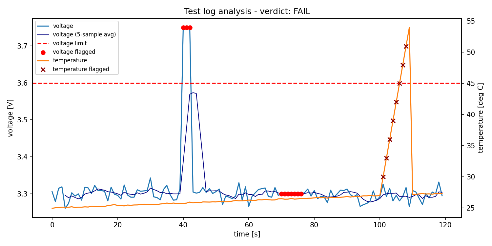

# HiL-style Test Log Analyzer (learning project)

Python tool that reads test logs from a device under test, cleans them, checks them against
limits and produces a pass/fail verdict plus a PNG report. It exits with code 0 (PASS) or
1 (FAIL), the way a CI server expects.



## What it does
- **Cleans messy logs**: junk strings (`NOISE`, `ERR`), gaps, duplicates, unsorted rows, boot-noise lines.
- **Checks**: over-voltage, stuck sensor, thermal runaway (rate of change).
- **Reports**: twin-axis plot with the flagged samples, generated headless (no display needed).
- **Tested**: pytest unit tests plus an end-to-end test; runs on GitHub Actions.
- **Simulated device**: a Wokwi Arduino sketch that produces logs in the same format (`device_sim/`).

## Run it
```bash
pip install -r requirements.txt
python scripts/generate_sample_log.py logs/sample_log.csv
python run_analysis.py logs/sample_log.csv --out report.png
pytest -v
```

## Limits (honest list)
- The device is **simulated** (Wokwi). No real hardware and no CAN bus yet.
- Logs are synthetic or from the simulator, not from a real test bench.
- The stuck-sensor check compares floats exactly, which only suits discrete ADC values.

## How this was built
<!-- Fill this in truthfully. Suggested wording: -->
Built as a learning project with AI assistance (Claude). I then read and ran every part,
and changed: <!-- list your own changes here, e.g. new check, different limits, extra tests -->

## Next steps
- [ ] Add a virtual CAN data source (python-can) and test it
- [ ] Run the same checks against a real microcontroller over USB serial
