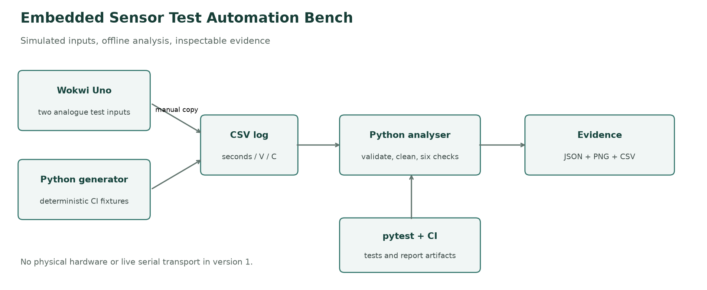
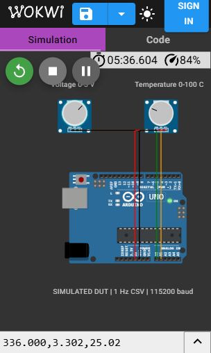
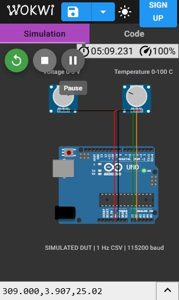

# Embedded Sensor Test Automation Bench

**Simulated DUT · Python · pytest · pandas · NumPy · Matplotlib**

[](https://github.com/venomxkapoor/embedded-test-bench/actions/workflows/ci.yml)

A small test bench for a device that reports supply voltage and board temperature. It reads a CSV, validates and cleans the input, applies six checks, and writes a verdict with a plot and row-level evidence. The device is simulated; no physical hardware is connected.


## Why this project

This project demonstrates a repeatable test-automation workflow for simulated embedded telemetry: measurements are validated, analyzed against configurable limits, and converted into inspectable verdicts and evidence. A simple Arduino Uno simulation provides a representative telemetry source.

The analyzer includes configuration validation, fault checks, input-quality tracking, boundary tests, CI artifacts and containerized execution.

## Architecture



Wokwi serial text is **manually copied into a CSV**. Python does not connect live to the browser simulator. A separate deterministic Python generator supplies the checked-in logs and CI tests. Both use the same three-column format.

## Run it

Use Python 3.12. From this folder:

```bash
python -m venv .venv
# Windows PowerShell
.venv\Scripts\Activate.ps1
# Linux/macOS instead: source .venv/bin/activate
python -m pip install -r requirements.txt
python run_analysis.py logs/healthy_log.csv --out-dir results/healthy
python run_analysis.py logs/faulty_log.csv --out-dir results/faulty
python -m pytest -q
```

If PowerShell blocks activation, use `.venv\Scripts\python.exe` in place of `python`; changing the execution policy is unnecessary.

The healthy example has 120 rows and returns **PASS / exit 0**. The faulty example has 115 received rows and returns **FAIL / exit 1**, intentionally. A missing file, invalid configuration, malformed CSV or too little usable data returns **ERROR / exit 2** with a clear message. On Linux inspect `$?`; in PowerShell inspect `$LASTEXITCODE` immediately after the command.

Each output folder contains `result.json`, `report.png` and `samples.csv`. An ERROR replaces an old result and removes stale chart/sample files. Keep output folders separate from the input logs.

## Data format

```csv
timestamp,voltage,temperature
0.0,3.300,25.10
1.0,3.310,25.20
2.0,3.290,25.30
```

Timestamp is elapsed **seconds**, voltage is **volts**, and temperature is **degrees Celsius**. Required column names are exact; additional columns are ignored. Timestamps must be nonnegative. At least two distinct usable timestamps are needed. Use `--skiprows N` only when N known boot-message lines precede the header.

## Six checks

Limits come from [`config/test_limits.json`](config/test_limits.json). Pass a different file with `--config my_limits.json`; omitted keys retain defaults and unknown keys are rejected.

| Check | Default rule | Meaning of the count |
| --- | --- | --- |
| Over-voltage | voltage > 3.6 V | Samples above the upper limit |
| Under-voltage | voltage < 3.0 V | Samples below the lower limit |
| Stuck sensor | 5 identical consecutive voltages | Every sample in each qualifying run |
| Over-temperature | temperature > 85 C | Samples above the upper limit |
| Rapid rise | dT/dt > 2 C/s | Flagged derivative estimates |
| Sampling gap | time difference > 2.5 s | Late-arrival boundaries |

Equality at a limit is accepted. The expected interval of 1 s describes the intended sampling rate and constrains configuration; it does not create an additional jitter check or estimate an exact lost-packet count.

Stuck detection uses `shift()` and grouped run lengths. It is retrospective: a five-sample run is labelled from its first sample after the whole log is available. Runs do not join across missing values or sampling gaps.

Temperature rate uses `np.gradient(temperature, timestamp)` within uninterrupted valid segments. Interior estimates use neighbouring points; endpoints use a one-sided difference. Segments with fewer than two valid readings have no rate estimate. Rates are rounded to 12 decimal places to avoid floating-point noise at an exact boundary.

## Cleaning without hiding errors

1. Validate the three required columns.
2. Convert numeric text; `ERR`, `NOISE`, blanks, infinity and NaN become missing values.
3. Record input-quality counts before dropping unusable timestamps and duplicate timestamps (keep first).
4. Sort the cleaned view chronologically, recording original out-of-order rows.
5. Forward-fill only an isolated interior sensor hole, at most one row, for the plot. Mark it as imputed; exclude it from sensor checks and derivatives.

Longer or edge holes remain missing. Even if a repair makes the plot readable, **any recorded input-quality issue makes the verdict FAIL**. A log passes only when no check and no quality rule fails. `result.json` separates sensor faults from input-quality findings; counts can overlap. `samples.csv` includes original data-row numbers and flags, while the original input file is unchanged.

The plotted line can connect points around a gap; vertical dotted lines identify time gaps. Inspect the raw log and annotated CSV when investigating a failure.

## Reproduce faults

```bash
python scripts/generate_sample_log.py
python scripts/generate_sample_log.py --scenario under_voltage --out logs/practice.csv
python run_analysis.py logs/practice.csv --out-dir results/practice
```

Scenarios: `healthy`, `over_voltage`, `under_voltage`, `stuck_sensor`, `over_temperature`, `rapid_temperature_rise`, `sampling_gap`, `malformed`, `faulty`. The seed is fixed for repeatability. Some scenarios legitimately trigger multiple checks: a sudden jump above 85 C can also exceed the rise-rate limit.

The combined faulty log produces: **3 over-voltage, 2 under-voltage, 7 stuck, 5 over-temperature, 7 rapid-rise samples, and 1 sampling gap**. These are deliberately injected examples, not measurements of a real product.

## Simulated DUT

The [Wokwi files and demonstration steps](device_sim/README.md) use an Uno and two potentiometers. A0 represents 0–5 V and A1 represents 0–100 C. A 1 Hz CSV record is printed at 115200 baud. The voltage has an explicitly added 3 mV alternating test ripple so an untouched virtual knob does not automatically trigger the simplified stuck detector.

### Captured Wokwi demonstration

These are actual screenshots of the running browser simulation. The two 20-row CSV windows are checked in as `logs/wokwi_healthy.csv` (1–20 s) and `logs/wokwi_overvoltage.csv` (159–178 s). They were copied from the serial monitor, not generated by the Python fixture script.

| Normal voltage | Over-voltage injected with the knob |
| --- | --- |
|  |  |

## Automated tests and CI

The suite contains 23 collected cases covering configuration, malformed input, repairs, voltage boundaries, stuck runs, thermal-rate timing, gaps, end-to-end results and real-process exit codes. Tests use a shared fixture, parametrization, temporary files and independent expected values.

```bash
python -m pytest -q --cov=hil_analyzer --cov=run_analysis --cov-report=term-missing
```

[GitHub Actions](https://github.com/venomxkapoor/embedded-test-bench/actions) runs tests, requires at least 85% line coverage, checks both sample exit statuses, builds and runs Docker, and uploads JUnit, coverage and report files as the `test-evidence` artifact. Coverage indicates executed lines, not proof that every possible fault is detected.

## Docker

```bash
docker build -t embedded-test-bench .
docker run --rm embedded-test-bench
docker run --rm embedded-test-bench python -m pytest -q
```

To keep reports on the host, create a `results` folder and mount it at `/app/results`:

```bash
# Linux/macOS
mkdir -p results
docker run --rm -v "$PWD/results:/app/results" embedded-test-bench
# PowerShell, after creating results
# docker run --rm -v "${PWD}/results:/app/results" embedded-test-bench
```

## Limitations

- DUT and data are simulated; no physical hardware is connected. This is not a full HiL bench and includes no CAN communication.
- Limits are demonstration values, not requirements from an ECU specification.
- Exact floating-point equality is a simplified stuck heuristic. A stable or coarsely quantized healthy input can be flagged, while small noise can hide a frozen sensor.
- Derivatives amplify noise. This version uses raw values without smoothing, filtering or calibrated uncertainty bounds.
- Input repair creates a plotting view, not replacement measurements. Forward-filling can hide events, which is why imputed values cannot clear a quality failure.
- CSV processing is offline and in memory. It does not validate electrical behaviour, serial transport, real-time latency or long-term reliability.

## Future engineering improvements

Potential extensions include a physical serial capture adapter, a noise-aware stuck-sensor rule, and chunked processing for large logs. CAN remains a separate project.
